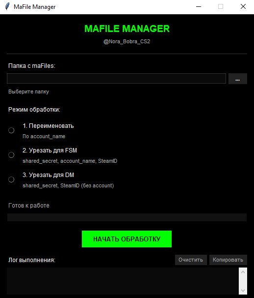

# MaFile Manager

Утилита для обработки maFile файлов Steam с графическим интерфейсом.



## Возможности
- Переименование файлов по account_name
- Урезание для FSM панели
- Урезание для DM панели

## Установка
1. Установите Python 3.6+
2. Установите зависимости:
```bash
pip install -r requirements.txt